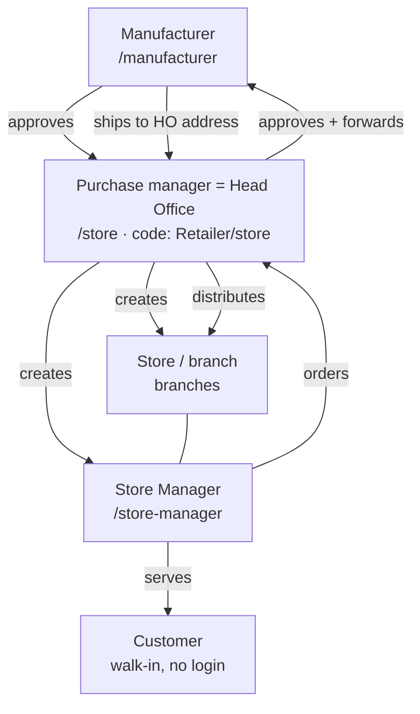

# Jewel Factory — Complete System Flow

Plain-language walkthrough of the WHOLE system: who the actors are, who creates
whom, how the public site works, how an order travels, approvals, shipping, chat,
search/filters, and the rules that never break. UI names vs code names are noted.

> **One line:** Jewel Factory is a **B2B gold-jewellery platform** connecting one
> **Manufacturer** to its **Purchase manager** network and their in-store
> **Customers** — **no price is shown anywhere**, and **customer personal data
> never reaches the manufacturer**.

> **Terminology (UI name vs code name):** the DB kept its original table names
> through a rename, so watch the mapping — **the UI display text is now
> "Purchase manager" everywhere a human reads it, but the code/DB/routes still
> say "Retailer"/"store"** (`stores` table, `storeGuard`, `/store/*` routes,
> `storeId`, `jf_store` cookie — all unchanged). Likewise "Store" (UI) = the
> `branches` table/code, "Store Manager" (UI) = `branch_managers`. Order types:
> "Catalog order" (UI) = `B2bOrder` model / `OrderKind.B2B` (code) — unchanged;
> "Customised order" (UI) = `CustomDesignOrder` model / `OrderKind.CUSTOM`
> (code) — unchanged. This doc uses the UI names ("Purchase manager", "Catalog
> order", "Customised order") when describing what a person sees, and calls out
> the code/DB name the first time it matters.

Related docs: [USER_MANUAL.md](USER_MANUAL.md) (non-technical staff guide) ·
[DATABASE.md](DATABASE.md) (schema) · [HANDOVER.md](HANDOVER.md) (fresh setup) ·
[SETUP_GUIDE.md](SETUP_GUIDE.md) (dev) · [DEPLOY_RENDER.md](DEPLOY_RENDER.md) ·
[AWS_MIGRATION.md](AWS_MIGRATION.md) · [PENDING.md](PENDING.md) ·
[../CLAUDE.md](../CLAUDE.md) (technical detail).

---

## 1. The three (+1) actors

| Actor (UI name) | Code / DB name | Portal | Does |
|---|---|---|---|
| **Manufacturer** | (global admin) | `/manufacturer/*` | Owns the design catalog (gold only, no price, auto `JF-XXXX`); approves Purchase managers; receives + fulfils orders; ships to the Purchase manager's fixed address. **Never sees customer data.** |
| **Purchase manager** = **Head Office** | `stores` table, code/routes say "Retailer"/"store" | `/store/*` | Self-registers → manufacturer approves. Creates Stores (branches) + Store Managers. **Does ALL approvals** for every branch (kiosk/Catalog order/Customised order), edits the requirement note, chats with Store Managers, restocks from the catalog, can also place its own Catalog order or Customised order directly. Has ONE fixed Head-Office address. |
| **Store** (branch) | `branches` table | — | One physical shop of the Purchase manager. A Purchase manager has MANY. Created by the Purchase manager. Has its own fixed address + restock PIN + store managers. |
| **Store Manager** | `branch_managers` table | `/store-manager/*` | Runs ONE branch. Serves walk-in customers on the kiosk; places kiosk/customised/restock orders (which go to the Purchase manager for approval). |
| **Customer** (walk-in) | — (not stored) | — | Comes to a store; the Store Manager helps on the kiosk. **No login, no personal data stored.** |

> **Terminology (UI name vs code name):** `stores` table = **Purchase manager**
> (UI) / "Retailer" or "Store" in code (= Head Office). `store_managers` table =
> **LEGACY/INERT** — the old "HO Manager" role is removed; the table is kept
> only for historical approver FK rows, no login/creation. `branches` table =
> **Store** (UI) — a Purchase manager's individual shop. `branch_managers`
> table = **Store Manager** (UI). Don't assume "store" in code means a shop —
> it means the Purchase manager; a shop is a `branch`.



---

## 2. The public site (logged-out)

Visiting `/` (or `/portal`, `/about`) with no session shows the **branded landing**:

- **Navbar:** logo · Catalog · About · **Login** · **Register here**.
- **Hero:** "Welcome to Jewel Factory" + call-to-action.
- **Featured showcase:** a few REAL catalog pieces (public `GET /api/kiosk/catalog`,
  no price) with a "Register to see the full catalog" CTA. The full catalog is
  visible only after login.
- **Why Jewel Factory:** feature cards (gold-only, AR try-on, **similar-design
  search**, customer privacy, multi-store).
- **Login popup** (from the Login button): two columns — **Purchase manager**
  (code: Retailer) and **Store Manager** — each with an embedded login form;
  the Purchase manager column links to "Register here". Manufacturer is
  intentionally NOT here.
- **Register prompt:** ~5 s after load a "Become a Purchase manager" popup
  appears once per session (dismissible), nudging new Purchase managers to
  `/store/register`.
- **`/about`:** roles, order flow, and the platform's principles.
- **`/manufacturer`:** the manufacturer sign-in entry — opening this URL shows the
  manufacturer login page (or redirects to the dashboard if already signed in).
  It is available from the public footer's **Manufacturer access** link.

### Shared portal-entry layout

The full-page Purchase manager, Store Manager, and Manufacturer sign-in screens,
plus Purchase manager registration, use `components/auth/PortalLoginScreen.tsx`. On tablet and
desktop it renders a contained two-panel card; on mobile it becomes a single
content panel. Sign-in forms remain vertically centred. Registration is the one
long-form variant: its right panel scrolls internally so fields never extend past
the rounded outer card or make the marketing panel drift while scrolling.

Authentication fields are supplied by the shared `StaffLoginForm`. Full-page
forms show visible labels; the compact public-site login modal keeps its denser
layout. The `/manufacturer` entry checks the manufacturer session on the server,
so a signed-out visit does not generate avoidable `/api/manufacturer/me` 401
errors in the browser console.

---

## 3. Who creates whom

```
Manufacturer      --approves-->  Purchase manager (registration)  [= Head Office; code: Retailer]
Purchase manager  --creates-->   Stores (branches)                [/store/branches]
Purchase manager  --creates-->   Store Managers (per branch)      [/store/branches → expand]
```

Stores + managers are NOT hardcoded — created via the portal (or the demo seed).

---

## 4. The Store Manager's device (Kiosk vs Restock)

The Store Manager logs in on a device (phone / tablet / PC):

- **Kiosk** (`/store-manager/kiosk`) — browse catalog + place a customer order.
- **Try-On** (`/store-manager/try-on`) — AR overlay of a piece on the customer.
- **Search** (`/store-manager/search`) — **similar-design search**: upload a photo,
  get visually-matching catalog designs. The Store Manager route and public
  storefront search provide separate **Take photo** and **Choose photo** actions.
  **Take photo** requests the rear camera on mobile; **Choose photo** opens the
  device's normal image picker so an existing gallery image can be used.
- **Custom Design** (`/store-manager/custom-design`) — capture a custom requirement
  (specs + note + reference image).
- **Restock** (`/store-manager/restock`) — order stock for THIS store.
  **PIN-protected** (per-branch restock PIN) so a customer holding the device can't
  open it.

Kiosk/custom carry **no customer PII** — only products + quantity + an editable
**requirement note** (displayed as "Remark") — so the device is safe to hand to
the customer.

**Favorites:** a heart icon on any product card saves it to a server-backed
favorites list, scoped per `(storeId, branchId)` — the Purchase manager's own
favorites (`branchId=null`) and a Store Manager's branch-scoped favorites never
share a list. Kiosk and Restock favorites are also kept separate from each
other on the Store Manager side.

---

## 5. Order flows

All flows end at the manufacturer, **via the Purchase manager (Head Office)
approval gate** — except a Purchase manager's own directly-placed order, which
skips its own approval step (see (d) below).

Order numbering: Kiosk orders and Catalog orders (code: `B2bOrder`) share one
running counter per manufacturer → **`JFA-####`**. Customised orders (code:
`CustomDesignOrder`) draw from a separate counter → **`JFC-####`**. (Old
formats like `GK-YYYYMMDD-XXXX`/`B2B-YYYYMMDD-XXXX`/`CD-YYYYMMDD-XXXX` only
appear on historical rows placed before this scheme.)

### (a) Kiosk customer order
```
Store Manager (kiosk) → order (products + qty + requirement note)
  → Purchase manager (Head Office) sees "Store X raised this", can EDIT the note, APPROVES
  → Manufacturer receives it (note + branch shown; NO customer data)
  → Manufacturer ships to the Purchase manager's HO address
  → Purchase manager distributes to the branch that raised it
```

### (b) Restock / Catalog order (code: B2B order)
```
Store Manager (restock, after PIN) → order from the manufacturer catalog
  → Purchase manager (Head Office) approves (can edit note, can set a delivery date)
  → Manufacturer → ships to the Purchase manager's HO address
  → on COMPLETED, stock materializes into the Purchase manager's Product table
```

### (c) Customised order (code: Custom design)
```
Store Manager (custom-design) → requirement (specs + note + reference image)
  → Purchase manager (Head Office) approves / forwards
  → Manufacturer receives a SANITIZED customised order (no customer data), numbered JFC-####
  → ships to the Purchase manager's HO address
```

### (d) Purchase manager places an order directly
The Purchase manager can place a Catalog order (from the Manufacturer
Catalogue) or a Customised order (via a direct request form) themselves,
without going through a branch/Store Manager. Since there is no one above the
Purchase manager to approve it, this order is **pre-approved automatically**
and goes straight into the manufacturer's queue — it never appears on the
Purchase manager's own Pending Approvals list. An optional **delivery date**
can be set when placing (or when approving a branch's order), and is
forwarded to the manufacturer.

**The requirement note (displayed as "Remark"):** written by the Store
Manager, editable by the Store Manager AND the Purchase manager, travels all
the way to the manufacturer. Contains the customer's ASK (size, engraving,
timeline) — **never personal data**.

**Karigar assignment (manufacturer-only):** on a Catalog/Kiosk order, the
manufacturer can select unassigned line-items and "Assign Karigar" — this
creates a Customised order (`JFC-####`) tying those items to an artisan and
flips them to `IN_PROCESS`. The Purchase manager/Store Manager never see this
step directly, only the resulting per-item status. This flow is being
migrated to hand off to an external Order-to-Delivery (O2D) system for real
production tracking — see [O2D-INTEGRATION.md](O2D-INTEGRATION.md) for the
full spec (not yet implemented as of this writing).

---

## 6. After sending — My Orders, status, chat

A Store Manager tracks sent orders on `/store-manager/my-orders` — a merged
Order History (Restock / Kiosk / Customised orders all in one list, each row
tagged with a source badge). Status buckets shown to the Store Manager (a
simplified view, derived from the real status):

- **Pending (Head Office)** — waiting for Purchase manager approval
- **Approved by Head Office** — approved, on its way to / with the manufacturer
- **Rejected**
- **Completed** — the Store Manager marks this when the piece reaches the customer
  (a flag, separate from the approval/production status)

The Store Manager sees only this simplified bucket — **NOT** the
manufacturer's granular production status. The Purchase manager's own
`/store/b2b-orders` ("Order History") list similarly merges Restock/Kiosk/
Customised orders into one list, with a source-type badge ("Restock" / "Store
Customer" / "Customised") and a "Placed by you" badge when the Purchase
manager placed it directly — but unlike the Store Manager, the Purchase
manager DOES see the manufacturer's real per-item status.

**The manufacturer's real order status** (`OrderStatus` enum, shown to the
manufacturer and the Purchase manager — not the Store Manager) is:

```
PENDING → IN_PROCESS → GHAT_RECEIVED → READY_FOR_DELIVERY → DISPATCHED → COMPLETED
                                                                       (or CANCELLED)
```

Each **line item** within a Catalog/Kiosk order also carries its own status
from the same enum, independent of the order-level status — one order can
have some items further along than others (e.g. one item `DISPATCHED` while
another is still `IN_PROCESS`). Customised orders track status at the
order level only (generally a single design per order).

**Per-order chat (Head Office ↔ Store Manager):**
- Every order has a "Message" thread; both sides can send.
- Store Manager: "Message Head Office" on My Orders.
- Purchase manager: "Message" on Pending Approvals AND on Custom Designs.
- Messages stay between the Purchase manager (Head Office) and the Store
  Manager (no customer, no manufacturer). Stored in `order_messages`, scoped
  to the Purchase manager (code: `storeId`).

**Search + filters (every order list — client-side):**
- **Store Manager** My Orders: search by order ID; filter by status bucket; From/To date.
- **Purchase manager / Head Office** (Kiosk / Customised / Restock): search by order ID; filter by
  status; filter by **Store (branch)** — each row shows a branch badge; From/To date.
- **Manufacturer** (Kiosk / Customised / Catalog Orders): search by order ID; filter by
  status; filter by **Purchase manager**; From/To date.
- Date range filters on the order's created date (inclusive).
- Purchase manager order detail shows which **Branch** it came from and any
  set **delivery date**; Manufacturer order detail shows which **Purchase
  manager** it came from plus the delivery date.

---

## 7. Manufacturer "Add Design" + Generate with AI (optional)

Manufacturer adds designs at `/manufacturer/catalog` → New. **There is no
Design Name field** (removed 2026-07-30, client request) — the auto-generated
design number is the sole identifier shown everywhere (catalog, kiosk, order
snapshots, search results). **Manual flow (always):**
1. Pick Category / Sub-category / Weight / Purity. (**Size** — a free-text
   field — appears only when Category is **Bangles**.)
2. **Karigar Code** (optional, manufacturer-internal only — which artisan
   makes the piece) and **Pieces** (default 1 — how many physical pieces make
   up the entered weight, e.g. a bangle pair = 2).
3. Upload catalog photo(s) → optional try-on PNG → Save.

Design number `JF-XXXX` is auto (Postgres sequence); no price, gold only. New
designs default to **Active** (visible). Karigar Code is **never exposed** to
the Purchase manager/Store Manager/customer — every tenant-scoped catalog/
search query strips it structurally, not just in the UI.

**Category / Sub-category / Purity taxonomy is manufacturer-editable** — the
manufacturer maintains its own `Category` → `Sub-category 1` → `Sub-category
2` and `Purity` lists (no longer a hardcoded static list), so new categories
or purities can be added without a code change.

**Generate with AI (shown only if `AI_FEATURES_URL` is configured):**
1. Upload a RAW product photo (phone photo — temporary, NOT saved), pick specs.
2. "Generate with AI" calls the AI-Features service and fills: Description,
   an attractive luxury catalog image, and a transparent try-on PNG (no
   name-generation step, since there is no design name anymore).
3. Everything is editable; you can regenerate any output, optionally with a custom
   instruction. Generated catalog/try-on images are click-to-zoom.
4. Review and Save.

AI is OPTIONAL — if not configured, the button is hidden and manual add works the
same. All AI lives in ONE service (see §12); requests are proxied server-side
(`/api/manufacturer/ai/*`) so the AI key never hits the browser.

---

## 8. Shipping & addresses

- Manufacturer knows only the **Purchase manager's fixed Head-Office address**
  → ships there.
- Purchase manager knows every branch's fixed address → distributes internally.
- Every order carries the branch name (`branchNameSnapshot`) so the Purchase
  manager and the manufacturer can see which store it is for.

---

## 9. Logins (3) + cookies

| Role (UI) | Login page | Cookie | Payload |
|---|---|---|---|
| Manufacturer | `/manufacturer/login` (or `/manufacturer`) | `jf_manufacturer` | manufacturerId |
| Purchase manager (Head Office; code: Retailer) | `/store/login` | `jf_store` | storeId (= retailerId) |
| Store Manager | `/store-manager/login` | `jf_branch_manager` | bmId.branchId.retailerId |

The old "HO Manager" login (`/store/manager/login` + `jf_manager`) is **removed**.

**PIN cookies** (device unlock, not logins): `jf_kiosk` (legacy per-store kiosk),
`jf_restock` (per-branch restock unlock).

**Secrets** (`lib/env.ts`): `MANUFACTURER_SECRET`, `STORE_SECRET`, `MANAGER_SECRET`,
`BRANCH_MANAGER_SECRET` (optional; falls back to `MANAGER_SECRET`).

**Demo credentials** (after `pnpm db:seed`): Manufacturer `admin@atjewellers.com` /
the password set with `SEED_MANUFACTURER_PASSWORD`; Purchase manager (demo mode)
`store@demo.com` / `store123`. Store Managers are created by the Purchase
manager — no default account.

---

## 10. Privacy rule (never break)

Customer personal data (name / phone / email / address) is **NOT stored** and
**NEVER** reaches the manufacturer. Kiosk + custom orders carry only products,
quantity, and the requirement note (displayed as "Remark"). The manufacturer
sees: the Purchase manager's business name, requirement note, the Purchase
manager's HO ship-to address, and product/spec detail — but **NOT** the
Purchase manager's city or branch name.

Related: **no price** anywhere (gold-only business); the store quotes the customer
directly.

---

## 11. Key DB tables

See [DATABASE.md](DATABASE.md) for the full schema.

| Table | Role / purpose |
|---|---|
| `stores` | **Purchase manager** (= Head Office; code/routes: Retailer/store) + fixed HO address (`kioskPinHash` legacy), `badge_label` (assigned retailer badge) |
| `store_managers` | **legacy/inert** (was "HO Manager"; role removed) — kept only for historical approver references |
| `branches` | **Store** + fixed address + `restock_pin_hash` |
| `branch_managers` | **Store Manager** |
| `manufacturer_products` | catalog design (gold only, no price, `JF-XXXX`, `has_tryon`, `pieces`, `karigar_code` — manufacturer-only, `size` — Bangles only); no `name` column in active use |
| `manufacturer_categories` / `manufacturer_sub_categories_1` / `manufacturer_sub_categories_2` / `manufacturer_purities` | manufacturer-editable taxonomy (Category → Sub-category 1 → Sub-category 2, plus Purity) — replaces the old static `lib/categories.ts` list |
| `favorite_products` | server-backed favorites, scoped `(storeId, branchId, kind)` — `kind` splits Kiosk vs Restock favorites on the Store Manager side |
| `karigars` | manufacturer-scoped master list of Karigar (artisan) codes, used by the Karigar-assignment flow |
| `kiosk_orders` | guest orders + `branch_id`, `branch_name_snapshot`, `requirement_note`, `completed_at`, `delivery_date`; the current kiosk flow does **not** collect or populate customer PII |
| `kiosk_order_items` / `b2b_order_items` | line items, each with its own `status` (`OrderStatus`) independent of the order-level status; `customised_order_id` links an item to a Karigar-assigned Customised order |
| `b2b_orders` | Catalog/restock order + `branch_id`, `branch_name_snapshot`, `requirement_note`, `completed_at`, `delivery_date` |
| `custom_design_requests` | + `branch_id`, `completed_at`; the current kiosk flow does **not** collect or populate customer PII |
| `custom_design_orders` | sanitized Customised order forwarded to the manufacturer, numbered `JFC-####`; also used by the Karigar-assignment flow (links back to a source Catalog/Kiosk order) |
| `retailer_custom_requests` | a Purchase manager's own directly-placed Customised order request, before a manufacturer assigns a Karigar to it (draws `JFA-####` from the shared counter) |
| `order_messages` | per-order chat (Head Office ↔ Store Manager); polymorphic (`order_kind` + `order_id`) |

---

## 12. AI services (one Python service, separate deploy)

All AI runs in ONE separate service: **AI-Features**
(repo `github.com/teamai-botivate/Jewel-Factory_AI`, deployed as a Hugging Face
Docker Space; `AI_FEATURES_URL` in Jewel Factory env).

| Endpoint | Input → Output |
|---|---|
| `/catalog` | raw photo → attractive studio catalog image |
| `/transparent` | raw photo + type → background-free try-on PNG (front-only) |
| `/describe` | image + specs → description |
| `/classify` | raw photo (no category picker) → best-guess category/sub-category from the taxonomy; used to pre-clean a similar-design-search query photo through `/catalog` (category only, never sub-category) before embedding it, so a cluttered real-world photo embeds closer to its own studio catalogue shot |
| `/embed/*` | image/text → OpenCLIP vectors (**visual / similar-design search**) |

The old embedder is merged here — `EMBEDDER_URL` points at the SAME Space; the
`/embed/image` contract is unchanged. One URL for everything AI; a future AI feature
is a new endpoint in the same service, no new deployment. Needs `OPENAI_API_KEY` on
the service. (The OpenAI-backed endpoints return `429 insufficient_quota` if the
OpenAI account has no credit; `/embed/*` uses local OpenCLIP and is unaffected.)

External storage/search backing this: **AWS S3 + CloudFront** for images (not
Cloudinary — that was migrated off), and **pgvector inside the production RDS
Postgres** for the embedding index (not Qdrant — also migrated off). Dev can
run against Supabase Postgres instead; production is AWS RDS.

---

## 13. Migrating an existing deployment (keep old data)

1. `pnpm db:deploy` — applies all Prisma migrations (idempotent).
2. `pnpm migrate:branches` — for every Purchase manager, create a default
   "Main Store" branch and link old kiosk/Catalog/Customised records to it.
   Safe to re-run.
3. `pnpm migrate:categories` — map legacy flat categories to the 14-category
   taxonomy (existing DB only).
4. Create real branches + store managers via `/store/branches`.

**Fresh DB (new client):** just `pnpm db:deploy` + `pnpm db:seed` — nothing manual.
Full client setup: [HANDOVER.md](HANDOVER.md).
